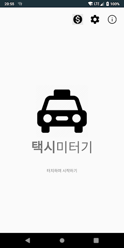
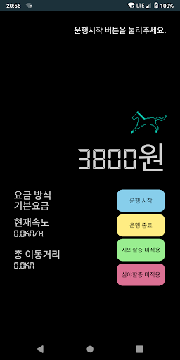

# 택시미터기 for Android

</img>
 
</img>

기기에 내장된 GPS를 이용해 현재속도와 이동거리를 측정해 택시 예상 요금을 계산합니다.
GPS 특성상 터널이나 전파간섭이 심한 장소에서는 정확도가 떨어질 수 있습니다.

여객자동차 운수사업법 제 2장 26조에 따라 공인되지 않은 미터기를 이용해 동승자에게 요금을 부과하는 행위는 금지됩니다.
이로 인한 법적 문제가 발생할 경우, 개발자에게는 별도의 책임이 없습니다.

***

### 배포 내역
* 2019\. 08\. 개발 시작
* 2019\. 10\. V1\.0 배포
* 2019\. 10\. V1\.1 배포
* 2020\. 01\. V1\.2 배포
* 2020\. 09\. V1\.3 배포